## 1.多线程与多进程

[PPT与代码](https://github.com/peiss/ant-learn-python-concurrent)

### 1.1 程序加速方法

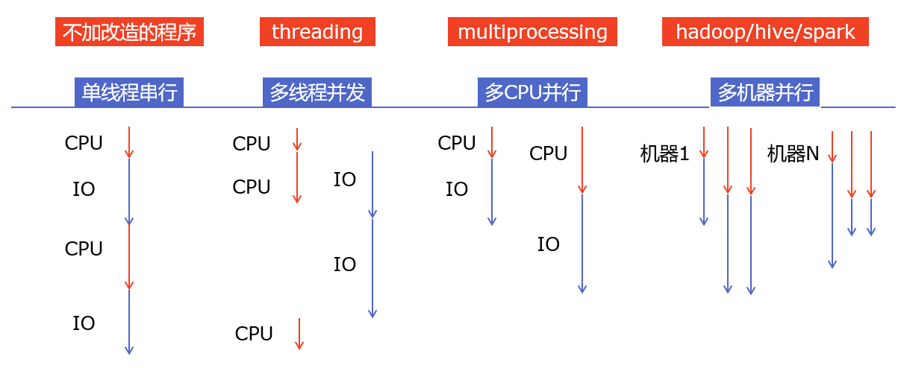

#### 1.1.1 多组件的Pipeline技术架构

复杂的事情一般都不会一下子做完，而是会分很多中间步骤一步步完成

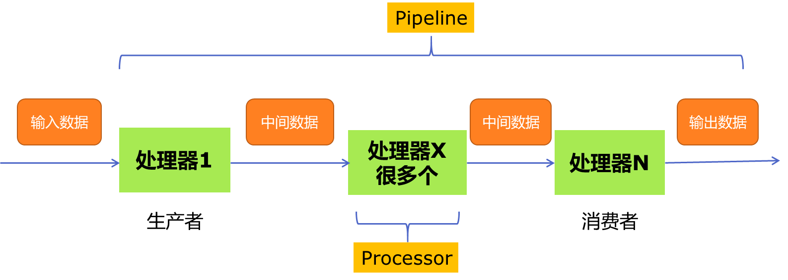

### 1.2 适用场景

Python并发编程有三种方式：

多线程Thread、多进程Process、多协程Coroutine

#### 1.2.1 CPU密集型计算、IO密集型计算

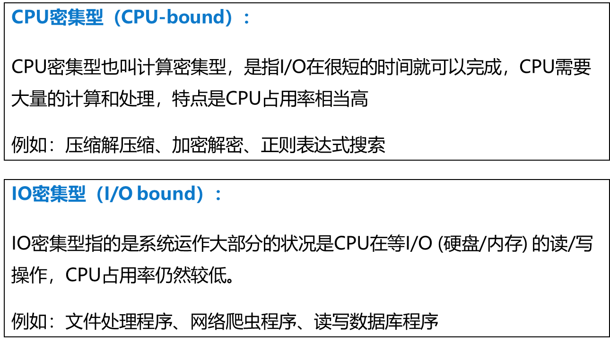

#### 1.2.2 CPU密集型计算、IO密集型计算

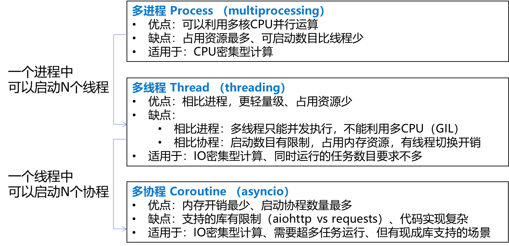

#### 1.2.3 怎样根据任务选择对应技术

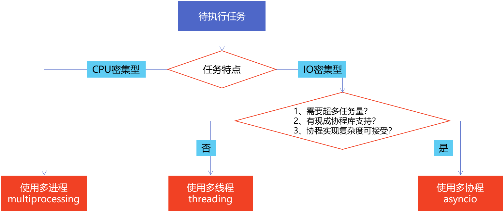

#### 1.2.4 Python速度慢的两大原因

1. 动态类型语言，边解释边执行

2. **GIL** 无法利用多核CPU并发执行

**GIL（全局解释器锁）**（Global Interpreter Lock，缩写GIL）

是计算机程序设计语言解释器用于同步线程的一种机制，它使得任何时刻仅有一个线程在执行。

即便在多核心处理器上，使用 GIL 的解释器也只允许同一时间执行一个线程。

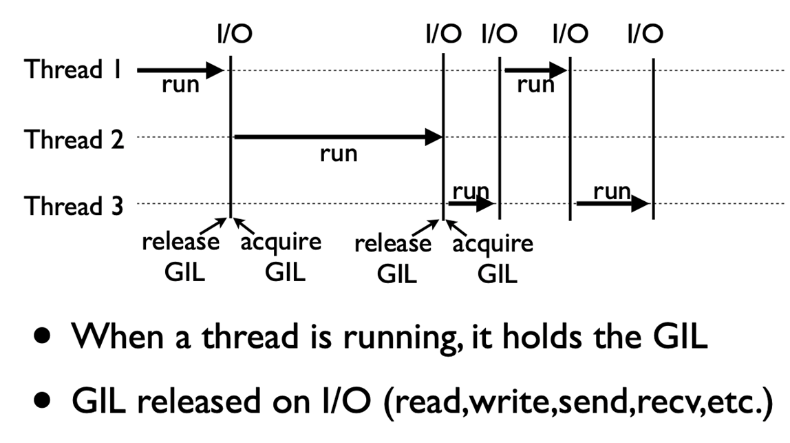

由于GIL的存在，即使电脑有多核CPU，单个时刻也只能使用1个相比并发加速的C++/JAVA所以慢。

##### 怎样规避GIL带来的限制？

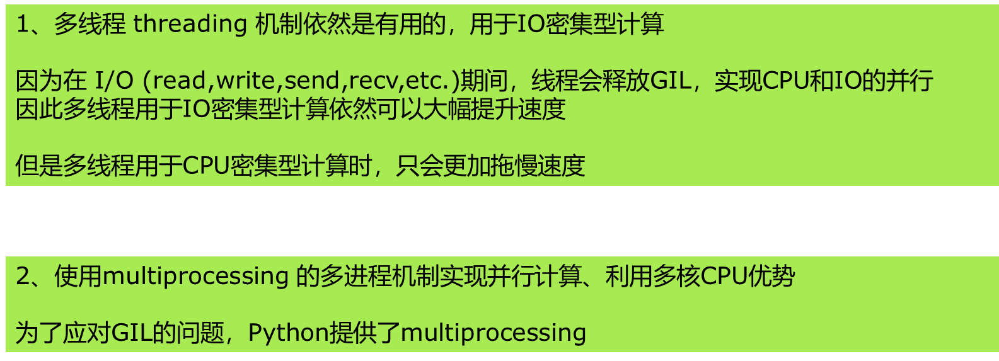

### 1.3 常用命令

1. **多线程：threading**，利用CPU和IO可以同时执行的原理，让CPU不会干巴巴等待IO完成
2. **多进程：multiprocessing**，利用多核CPU的能力，真正的并行执行任务
3. **异步IO：asyncio**，在单线程利用CPU和IO同时执行的原理，实现函数异步执行
4. **Lock:**防止冲突访问
5. **Queue:**实现不同线程/进程之间的**数据通信**，实现生产者-消费者模式
6. **线程池Pool/进程池Pool**，简化线程/进程的任务提交、等待结束、获取结果
7. **subprocess启动外部程序的进程**，并进行输入输出交互

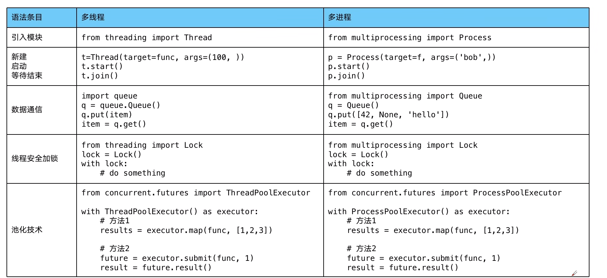

```python
wait(task_list, return_when=ALL_COMPLETED)  # 等待所有任务完成再后继续执行
```

ProcessPoolExecutor声明需要放在main函数中

#### 1.3.1 多线程数据通信的queue.Queue

queue.Queue可以用于多线程之间的、线程安全的数据通信

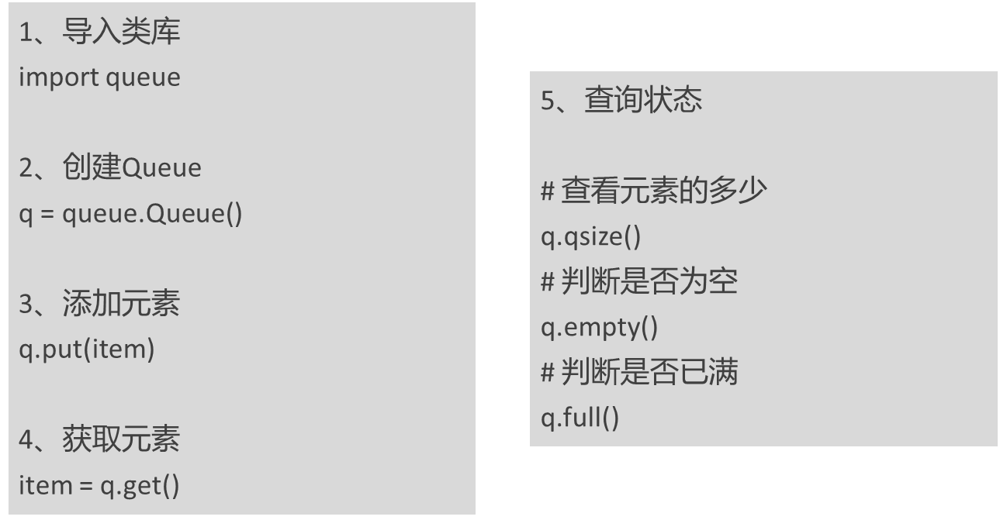

q.put() : 等待空后再添加

q.get() : 等待满时再获取

[使用生产者与消费者架构进行爬虫](https://www.bilibili.com/video/BV1bK411A7tV?p=5&spm_id_from=pageDriver&vd_source=9e04098c4969c916e3d15180f6234e59)

### 1.4 线程安全

线程安全指某个函数、函数库在多线程环境中被调用时，能够正确地处理多个线程之间的共享变量，使程序功能正确完成。

由于线程的执行随时会发生切换，就造成了不可预料的结果，出现线程不安全。

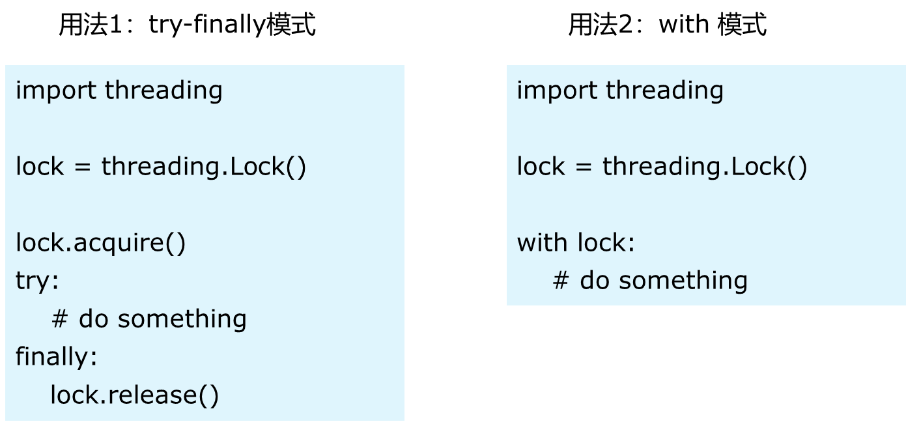

### 1.5 线程池

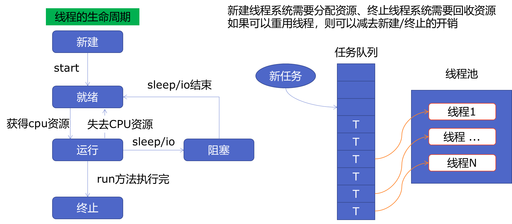


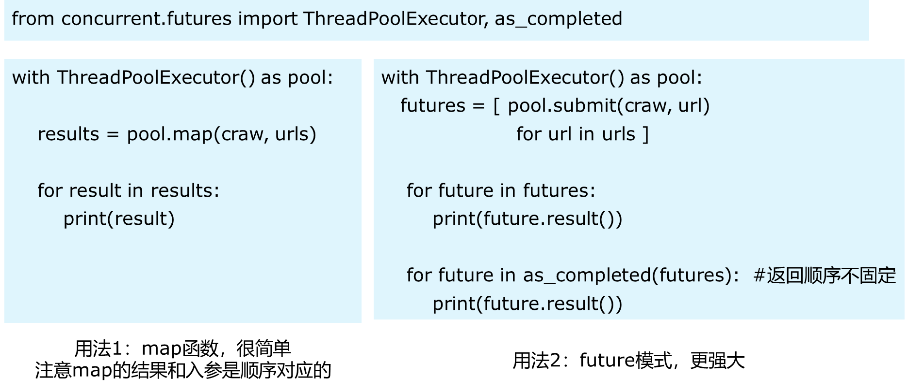


### 1.6 Python 异步IO库介绍：asyncio

##### 多协程


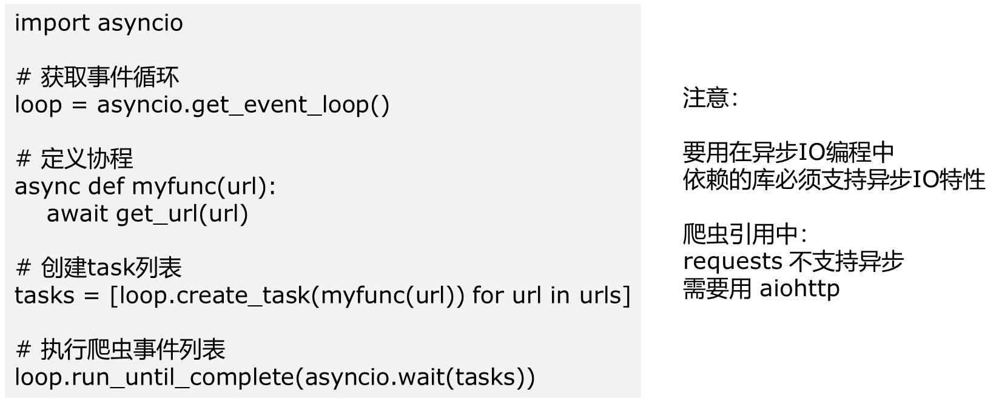

##### 信息量（控制并发度）

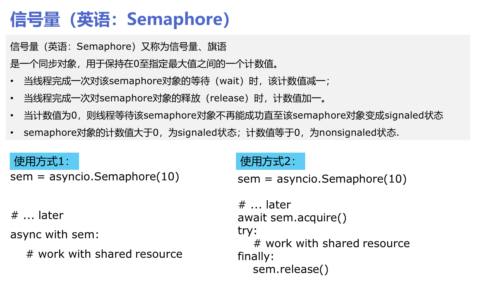

### 1.7 多线程易错问题

1.7.1 输入多线程的参数发生改变，输入函数的参数为参数的引用

解决方法：输入参数的拷贝.copy() 

```python
for i in range(union_num):
    param_list.append(param)  
    # 传入的param_list会发生改变；在多线程提交运行时，主线程param_list.append(param)也正在执行，导致多线程中的param_list发生改变
    len = param_list.__len__()
    if len % client_batch == 0:
        task = executor.submit(run, param_list.copy()) #  .copy添加副本而不是传入引用
        task_list.append(task)
    elif (i + 1) == union_num:
        task = executor.submit(run, param_list.copy())
        task_list.append(task)
wait(task_list, return_when=ALL_COMPLETED)
```


### 1.8 多进程log和kill

##### 1.8.1 log

```python
from multiprocessing import Process, Queue
from logging.handlers import RotatingFileHandler, QueueHandler
import logging, os, psutil

def kill_process_by_pid(pid):
    try:
        # 使用PID获取进程对象
        process = psutil.Process(pid)
        # 终止进程
        print(f"killing {pid}")
        process.terminate()
        print(f"killed {pid}")
    except psutil.NoSuchProcess:
        print(f"No process with PID {pid}")


def set_logger(log_name="Logger", log_level="INFO", path = "common.log"):  # common logger
    """
    log_level =  {"DEBUG", "ERROR", "INFO"}
    """
    if not os.path.exists(path):
        os.makedirs(os.path.dirname(path), exist_ok=True)
        with open(path, mode="w", encoding="utf-8") as f:
            pass
        
    # define logging level
    log_level_mappings = {"DEBUG": logging.DEBUG, "ERROR": logging.ERROR,}
    log_level = log_level_mappings.get(log_level.upper(), logging.INFO)
    logger = logging.getLogger(log_name)
    logger.setLevel(log_level)

    # define logging formatter
    formatter = logging.Formatter("%(asctime)s %(filename)s[line:%(lineno)d] %(levelname)s %(message)s")
    
    # define file_handler
    file_handler = RotatingFileHandler(filename=path, maxBytes=1024**3,
                                        backupCount=2, encoding="utf-8")  #单log maxBytes字节，最多保存10个历史log
    file_handler.setFormatter(formatter)
    file_handler.setLevel(log_level)
    
    # define stream_handler
    stream_handler = logging.StreamHandler()
    stream_handler.setFormatter(formatter)
    stream_handler.setLevel(log_level)
    
    # add handler
    logger.addHandler(file_handler) 
    logger.addHandler(stream_handler)
    return logger

    
class QueueLogger:  # win multi-processing logger
    def __init__(self, log_path="./queue.log",log_level = "INFO", use_queue = True) -> None:
        self.log_path = log_path
        self.log_level = log_level
        if use_queue:
            self.loggerQueue = Queue()
            self.pidQueue = Queue()
            

    def kill_all_pid(self):  # when logger_process get error message
        pid_list = []
        while not self.pidQueue.empty():
            pid_list.append(self.pidQueue.get())
        for pid in pid_list[::-1]:
            kill_process_by_pid(pid)  # kill by LIFO 


    def _sub_logger_process(self):  # 在子进程从共享队列中获取message并处理输出
        queue = self.loggerQueue
        logger = set_logger('queueLogger',self.log_level, self.log_path)
        # run forever
        while True:
            # consume a log message, block until one arrives
            message = queue.get()
            if message is None:  # check for shutdown
                break
            # log the message
            #print(f"{message.levelname} process name:{message.processName}, process id:{message.process}")  # 可获取message所在进程id
            logger.handle(message)

            if message.levelname == "ERROR":  # kill all pids if error
                self.kill_all_pid()
                break
    
    def start_logger_process(self):  # 开启queue message处理进程
        logger_p = Process(target=self._sub_logger_process, args=())
        logger_p.start()
    
    def shutdown_logger_process(self):
        self.loggerQueue.put(None)

    def init_queue_log(self, error_kill = True):
        # add shared queue handler
        queue = self.loggerQueue
        sub_logger = logging.getLogger('queueLogger')
        queue_handler = QueueHandler(queue)  # add a handler that uses the shared queue
        sub_logger.addHandler(queue_handler)
        sub_logger.setLevel(logging.DEBUG)  # 设置子进程记录的日志等级
        if error_kill:
            self.pidQueue.put(os.getpid())  # 存入pid，log为error时清理所有pid
        return sub_logger


from random import random
import time
from multiprocessing import current_process
def test(queueLogger):  # child processes
    # create a logger
    logger = queueLogger.init_queue_log()
    # get the current process
    process = current_process()
    # report initial message
    logger.info(f'Child {process.name} starting.')
    # simulate doing work
    for i in range(5):
        # report a message
        #print(f'Child {process.name} step {i}.')  # logger为按序输出
        logger.debug(f'Child {process.name} step {i}.')
        # block
        if i ==3:
            logger.error(f'log set error in Child {process.name} step {i}.')
        time.sleep(random())
    # report final message
    logger.info(f'Child {process.name} done.')
 

# protect the entry point
if __name__ == '__main__':
    queueLogger = QueueLogger(log_level="debug",log_path=r".\test111\test111.log")
    queueLogger.start_logger_process()
    # report initial message
    logger = queueLogger.init_queue_log()
    logger.info(f'Main process started. process id - {os.getpid()}')
    # configure child processes
    processes = [Process(target=test, args=(queueLogger,)) for i in range(5)]
    # start child processes
    for process in processes:
        process.start()
    # wait for child processes to finish
    for process in processes:
        process.join()
    # report final message
    logger.info('Main process done.')
    # shutdown the queue correctly
    queueLogger.shutdown_logger_process()
```


##### 1.8.2 kill

```
# 未测试
import os
def terminate_process(pid):
    try:
        if os.name == 'posix':  # Linux
            os.kill(pid, signal.SIGTERM)
        elif os.name == 'nt':  # Windows
            subprocess.run(['taskkill', '/F', '/T', '/PID', str(pid)], check=True)
    except Exception as e:
        print(f"Failed to terminate process {pid}: {e}")
```


## 2. git 操作

##### 项目中创建local user

```bash
git config --local user.name
git config --local user.name YC
```

##### 清除本地缓存

```bash
git rm -r --cached . 
```

##### 强制拉取

1. `git reset --hard origin/master`  # 将本地分支重置为远程分支
2. 将变动的文件放入history文件夹防止丢失
3. `git pull`


##### Access denied（无权限问题）

控制面板----------用户账户 ----------管理Windows凭据 ，删掉没有权限的账号 ；重新git clone 输入用户名和密码

##### git push冲突

push后打开对应文件，解决冲突后，add-commit-push


## 3.grpc数据传输

### 1.环境

```bash
pip install grpcio 
pip install grpcio-tools
```

### 2.流程

#### 1.定义新建协议文件 （.proto文件）

```python
syntax = "proto3";
//package example;

//定义数据传输 类
service FormatData {
    // 定义rpc方法 （数据类型）
  rpc DoFormat(actionrequest) returns (actionresponse){}      //传输图片数据接口
  rpc LaunchCheck(launchinspect) returns (launchresponse){}  //启动一片wafer数据传输，通知接口
  rpc EndCheck(endinspect) returns (endresponse){}           //结束一片wafer数据传输，通知接口
  rpc Remodel(remodelreq) returns(remodelresponse){}
  rpc GetPolygon(polygonrequest) returns (polygonresponse){}   //计算多边形面积与交集接口
  rpc DoFormatBatch(batchactionrequest) returns(actionresponse){}
}

//定义数据类型
message Coordinate_Info{
  int32 xMap = 1;   //图片在拍照原图上的x坐标
  int32 yMap = 2;   //图片在拍照原图上的y坐标
  int32 imageRow = 3; //拍照原图x坐标
  int32 imageCol = 4; //拍照原图y坐标
}

message Image{
  bytes data = 1;  // 传输的bite格式图片
  int32 imageWidth = 2;
  int32 imageHeight = 3;
}

message actionrequest {
  Coordinate_Info coor_info = 1;
  int32 orient = 2;  //0 : 正面  1 ： 反面
  string recipe = 3;
  string waferID = 4;
  repeated Image image = 5;
}

message batchactionrequest{
  repeated actionrequest request=1;
}

message launchinspect {
  string recipe = 1;
  string waferID = 2;
}

message endinspect {
  string recipe = 1;
  string waferID = 2;
}

message remodelreq {
  string recipe = 1;
}

message polygonrequest {
  string polygonCoordinate = 1;
  string defectCoordinate = 2;
  int32 imageWidth = 3;
  int32 imageHeight = 4;
}

message actionresponse{
  string text=1;
}

message launchresponse{
  string text=1;
}

message endresponse{
  string text=1;
}

message remodelresponse{
  string text=1;
}

message polygonresponse{
  string polygonAreaList = 1;
  string polygonUnionDefectAreaList=2;
}
```

#### 2.生成grpc代码（pb2.py ,pb2_grpc.py  ）

```python
python -m grpc_tools.protoc -I. --python_out=. --grpc_python_out=. ./data.proto
```

命令说明：

- -I proto协议文件目录
- --python_out和--grpc_python_out 生成python代码的目录
- 命令最后面的参数是proto协议文件名

命令执行后生成helloworld_pb2.py文件和helloworld_pb2_grpc.py文件。

- helloworld_pb2.py - 主要包含proto文件定义的消息类。
- helloworld_pb2_grpc.py - 包含服务端和客户端代码


### [错误码与服务端客户端发送与接收错误信息](https://www.bilibili.com/video/BV1j54y1z7kp/?spm_id_from=333.788.recommend_more_video.-1&vd_source=9e04098c4969c916e3d15180f6234e59)

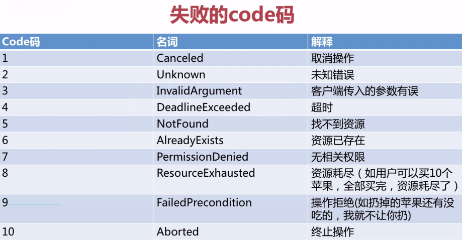

利用json.dumps()


## 4. Torch

### 4.1 模型默认保存位置

```python
if pretrained:
    state_dict = load_state_dict_from_url(url, progress=progress) #progress显示加载条
    model.load_state_dict(state_dict)
```

文件默认保存在`/home/govion/.cache/torch/hub/checkpoints/resnext50_32x4d-7cdf4587.pth`


## 5. Numpy

### 5.1 np.where()

np.where()` 是 NumPy 库中的一个函数，用于根据指定的条件从数组中选择元素。它可以根据给定的条件返回一个新的数组，其中包含满足条件的元素的索引或值。

`np.where()` 函数的一般形式如下：

```python
numpy.where(condition[, x, y])
```

参数说明：

- `condition`：一个布尔数组或布尔表达式，用于指定条件。
- `x`：可选参数，满足条件的位置上要填充的值或数组。
- `y`：可选参数，不满足条件的位置上要填充的值或数组。

以下是一些示例，演示了如何使用 `np.where()` 函数：

1. 返回满足条件的元素的索引：

```python
import numpy as np

arr = np.array([1, 2, 3, 4, 5])
condition = arr > 2

indices = np.where(condition)
print(indices)
```

1. 返回满足条件的元素的值：

```python
import numpy as np

arr = np.array([1, 2, 3, 4, 5])
condition = arr > 2

values = np.where(condition, arr, 0)  # 将不满足条件的元素置为0
print(values)
```

1. 通过 `np.where()` 替换数组中的元素：

```python
pythonCopy code
import numpy as np

arr = np.array([1, 2, 3, 4, 5])
condition = arr > 2

new_arr = np.where(condition, arr * 2, arr)  # 满足条件的元素乘以2，不满足条件的保持不变
print(new_arr)
```

`np.where()` 函数在处理条件和数组时非常灵活，可以根据不同的应用场景进行变化。它在数据处理和转换中非常有用。


## 6. shell

### Command-WIN

#### 1. scp

##### 1. download远程文件命令

```bash
scp username@ip:filepath localpath
```

##### 2. 在win上开启远程scp功能

 	1. 设置-应用-可选功能-添加可选功能-安装OpenSSH服务器
		2. 管理员权限打开power shell    `net start ssdh`
		3. cmd 查看用户名 `net user`  密码通常为 微软密码 不是pin码

### Command-Linux

#### 1. 移植anaconda环境

跨电脑：直接复制env目录，再手动调整

tips：pip list 报python环境不对：手动修改 `env/env name/bin/pip` 第一行位置

#### 2. VS Code 免密登录

1.Windows  cmd 窗口执行 [ssh-keygen](https://so.csdn.net/so/search?q=ssh-keygen&spm=1001.2101.3001.7020) -t rsa -b 4096  enter四次

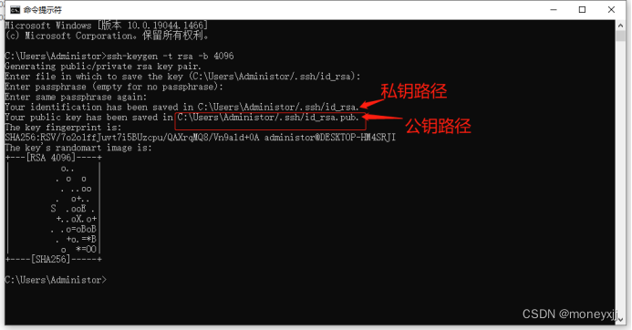

2.在VS Code ssh config中添加公钥

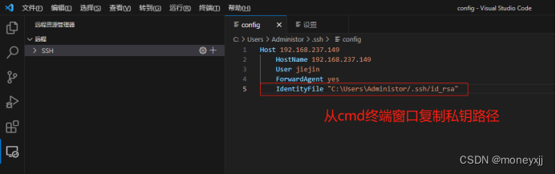

3.Linux进入`~/.ssh` 下（若没有则`ssh-keygen -t rsa `生成）

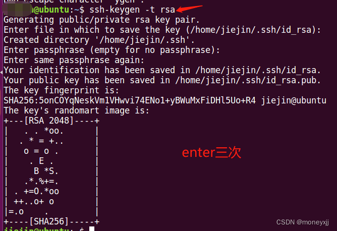


进入authorized_keys 再最后添加win生成的公钥 (e.g.

```
ssh-rsa AAAAB3NzaC1yc2EAAAADAQABAAACAQDKvstHuZaXVUGVz5zCpRf/dhFN335oOFOHvGhcFTWAK7gQjr8gSi0Ol+eovyA/9T7HK9c6SJvEdO6jaeSSk4CEcD3cxWWXPl8jM/QZKxGlE2n/YZt4BHZZ8IY7u0+Iia5RYZTAgOYiplF5cKDoyuZBRXgx1Hpw0KqYYjMtK2ia0orQML0h92QBD9ER7okh1x8CmFgjhRlKkKvO+oOzMBMoum+LIp0MubEYQM1lEoft+zZXJsJdfU+TfFa0S+VL7xFgBceC5WKJC0QJ3dEMhdRkSHNc5DAoKPk37qUxOrkSt2hsixfh9RUp7aB8tRmGsMtkWZ91BaB2kQVX7s6E5PyJmBl90LN0PaXjUWLbh0n+2ijE8iKgE+zAfEgnN5CpC9mR52HyU3Tdu8cCbPEzXgq4nRdAEPOfx45TxTGJbtFhX8D3BN0rZOMs9ykyhtvJOIBAzvJR+56V2ZEyxkt6i+xxvinLu5GysEeJ214HKl2r0p0wM2B6jhCKOtH8qAOz3IN9il2AcVNWAbODlzBReSGCOEwKYmindimXKbITXVxHxKLKoNv7dVaBdj5savpiJru53+iy3NKAzGg448RbCIftUIr5Q+HWWflHV+PCIaEqRx2Frc/fn/Qr5S+zHrlI21HKVJw1HEVfYcb5I/nSj5BrC5Jbc5XxehlcrQhLr6WVkw== 75703@taoyucheng
```


#### 常用命令

```bash
ps PID # 查看正在运行的PID命令
df -TH (path) # 查看磁盘大小 不加path则显示所有
du -sch(h) (path) # 查看文件大小 总大小（递归子文件大小） 
```

##### Linux上清理pip config

搜索并编辑pip.ini文件


## 7. `pyinstaller`

### 1. `命令`

```bash
pyinstaller -D --key govion2023 main.py  # 文件夹打包不用解压缩，--key添加秘钥 
```

#### 2. 自定义文件没有被打包入exe

`.spec` 文件中的 `datas` 部分用于指定要包含在可执行文件中的额外文件。这些文件可以是你的应用程序所需的资源文件、配置文件、模板文件等。通过在 `datas` 部分配置这些文件，你可以确保它们在打包后的可执行文件中被正确地包含。

`datas` 部分的语法如下：

```
pythonCopy code
# Example .spec file

# ...

# List of additional data files to be included in the executable.
# Each item should be a tuple containing (source, destination) paths.
# source: The path to the file you want to include.
# destination: The path where the file will be placed in the executable.
# If destination is '.', the file will be placed in the same directory as the main executable.
datas = [
    ('path/to/your/file.txt', '.'),   # Include file.txt in the same directory as the executable
    ('path/to/your/images/*', 'images'),  # Include all files from the images directory
    # ...
]

# ...
```

在上述示例中，`datas` 列表中包含了要包含在可执行文件中的文件。每个元素都是一个元组，其中第一个元素是源文件的路径，第二个元素是目标文件在可执行文件中的路径。如果目标路径是 `'.'`，则文件将被放置在与主可执行文件相同的目录中。

你可以使用通配符（`*`）来匹配文件，如上面的示例中的 `('path/to/your/images/*', 'images')`，这将包括 `path/to/your/images/` 目录下的所有文件，并将它们放置在可执行文件目录中的 `images` 子目录中。

为了使用 `.spec` 文件中的 `datas`，你需要通过 `PyInstaller` 命令来生成可执行文件，而不是直接运行 `.py` 脚本。你可以在命令行中指定 `.spec` 文件：

```
bashCopy code
pyinstaller your_app.spec
```

总之，通过在 `.spec` 文件中的 `datas` 部分配置，你可以将额外的文件包含在最终的可执行文件中，以便于分发你的应用程序时能够携带所需的资源。


##### 迁移时报错缺失某个模块

使用`--hiddenimport`

eg.   `pyinstaller --hiddenimport=_socket main.py`


## 8. `Common`

### 8.1 `os`

##### `os.path.splitext()`

**获取后缀**

```
pythonCopy code
import os

# 文件路径
file_path = "example.txt"

# 使用os.path模块的splitext函数获取文件名和后缀名
file_name, file_extension = os.path.splitext(file_path)

# 打印结果
print("文件名:", file_name)
print("后缀名:", file_extension)
```

output：

```
makefileCopy code
文件名: example
后缀名: .txt
```


## 9. `torch_tensorrt`

##### `commom errors`

##### 1. error form using  `\\`  in network

```bash
Traceback of TorchScript (most recent call last):
            %1 : bool = prim::Constant[value=0]()
            %2 : int[] = prim::Constant[value=[0, 0]]()
            %4 : Tensor = aten::_convolution(%x, %w, %b, %s, %p, %d, %1, %2, %g, %1, %1, %1, %1)
                          ~~~~ <--- HERE
            return (%4)
RuntimeError: CUDA error: CUBLAS_STATUS_EXECUTION_FAILED when calling `cublasGemmEx
```

**Solution  : using  `*`  to replace**


## 10. C++

##### `1. VScode+cmake demo` 

**Source Code**

```c++
//test.cpp
#include<iostream>
using namespace std;
int main(){
    cout<<"hello world"<<endl;
    int a=0, b=1,c;
    c=a+b;
    cout<<c<<endl;
}

//CMakeLists
cmake_minimum_required(VERSION 3.10)
project(test)
# 指定可执行文件输出路径，设置为build下的bin目录
set(EXECUTABLE_OUTPUT_PATH ${PROJECT_BINARY_DIR}/bin)

# 发现一个目录下所有的源代码文件并将其存储在变量DIR_SRCS中
aux_source_directory(. DIR_SRCS)

# 生成可执行文件
add_executable(testapp ${DIR_SRCS})
```

**Cmake compile**

```bash
mkdir build
cd .\build\
cmake ..
cmake --build . --config Release
```

`1. libtorch demo` 

```C++
//D:\Code\C_plus\RDplus_inference_c\Torch_demo\example-app.cpp
#include<torch/script.h>
#include<torch/torch.h>
using namespace std;
int main()
{
    torch::Tensor output;
    cout << "cuda is_available: " << torch::cuda::is_available() << endl;
    torch::DeviceType device = at::kCPU; 
    if (torch::cuda::is_available())
        device = at::kCUDA;
    output = torch::randn({ 3,3 }).to(device);
    cout << output << endl;
    return 0;
}

//D:\Code\C_plus\RDplus_inference_c\Torch_demo\CMakeLists.txt
cmake_minimum_required(VERSION 3.18 FATAL_ERROR)
project(example-app)
set(CMAKE_PREFIX_PATH D:/Code/C_plus/libtorch-win-shared-with-deps-debug-2.0.1+cu118/libtorch)# libtorch 地址
find_package(Torch REQUIRED)
include_directories("D:/Code/C_plus/libtorch-win-shared-with-deps-debug-2.0.1+cu118/libtorch/include") # libtorch 头文件
include_directories("D:/Code/C_plus/libtorch-win-shared-with-deps-debug-2.0.1+cu118/libtorch/include/torch/csrc/api/include")# libtorch 头文件
set(CMAKE_CXX_FLAGS "${CMAKE_CXX_FLAGS} ${TORCH_CXX_FLAGS}")

add_executable(example-app example-app.cpp)
target_link_libraries(example-app "${TORCH_LIBRARIES}")
set_property(TARGET example-app PROPERTY CXX_STANDARD 17)

# The following code block is suggested to be used on Windows.
# According to https://github.com/pytorch/pytorch/issues/25457,
# the DLLs need to be copied to avoid memory errors.
if (MSVC)
  file(GLOB TORCH_DLLS "${TORCH_INSTALL_PREFIX}/lib/*.dll")
  add_custom_command(TARGET example-app
                     POST_BUILD
                     COMMAND ${CMAKE_COMMAND} -E copy_if_different
                     ${TORCH_DLLS}
                     $<TARGET_FILE_DIR:example-app>)
endif (MSVC)
```


### 10. 404

1. cmake libtorch报错No CUDA toolset found

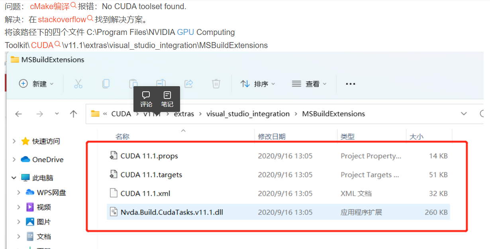


拷贝至：C:\Program Files\Microsoft Visual Studio\2022\Community\MSBuild\Microsoft\VC\v170\BuildCustomizations


## 11. OpenCV

### 11.1 插值方法

[resize 方法](https://blog.csdn.net/sinat_29957455/article/details/104584744)：

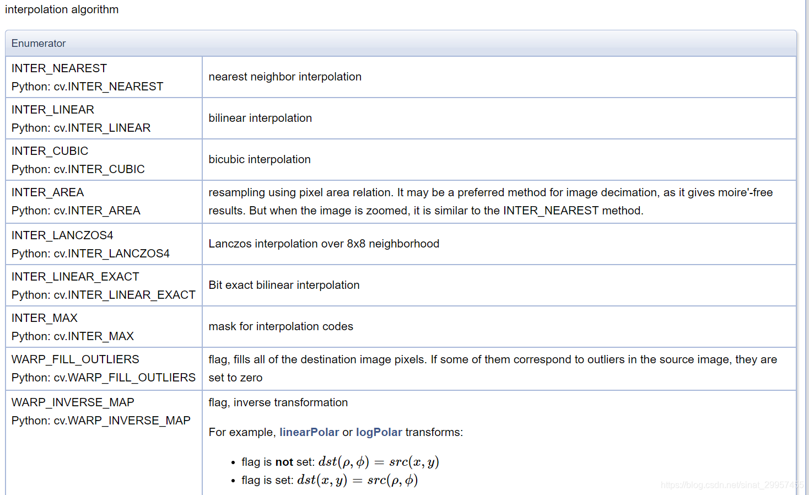


##### demo 

 wV\


## 404 常见报错

1.第一次导入失败

```python
#import a/b/test.py报错；import a/test.py不报错
import a.b.test  
#导入test.py文件报错，在上方添加
sys.path.append('a/b/') # 添加搜索路径，运行生成_pycashe_
# _pycashe_作用： 下次运行时，若模块没有被修改过，将会跳过编译的步骤，直接执行缓存的字节码文件，从而加速项目运行的准备时间
```

# 

#### pandas

1.版本不兼容报错

AttributeError: 'DataFrame' object has no attribute 'append'

 

解决方案：

1.降低版本（验证有效）

pip install pandas==1.3.4

2.替换函数（未验证）

```pyhton3
result = result.append(new_data,ignore_index=True)
result = result.concat([result ,new_data])
```


Tips：

文件相对路径不能以/开头（./dir或dir）


#### PIL

1.PIL读取RGB的黑白Mask，转换为tensor后变成一维（而不是三维，用同样png格式的RGB黑白Mask--自己制作出来确是三维）；导致与Pred出的结果图对比时出错

解决方法：使用cv2读取来跳过PIL读取

原因：未分析

```pyhton
            gt = cv2.imread(gt)
            gt = cv2.cvtColor(gt, cv2.COLOR_BGR2GRAY)
            gt = Image.fromarray(gt)
            # gt = Image.open(gt)
            gt = self.gt_transform(gt)
```


```
epoch:3 loss:1.3051 lr:0.0002 p_true:0.13 p_fake:0.381: 100%|██████████| 4/4 [00:17<00:00,  4.43s/it]
INFO:simplenet:Training discriminator...
  0%|          | 0/4 [00:00<?, ?it/s]----- 0 I-AUROC:0.7218(MAX:0.7218)  P-AUROC0.3444(MAX:0.3444) -----  PRO-AUROC0.0353(MAX:0.0353) -----
epoch:1 loss:1.12703 lr:0.0002 p_true:0.102 p_fake:0.416:  50%|█████     | 2/4 [00:10<00:10,  5.36s/it]
```


#### nohub

把程序脱离终端

操作如下（我原先的运行指令是：./server 80）：

nohup 你的shell命令 &（如：nohup ./server 80 &）
nohup命令可以让你的shell命令忽略SIGHUP信号，即可以使之脱离终端运行。这样就可以让你的程序免于被自动关闭了，当然，可千万别忘了关闭，所以结尾的&作用就是运行在后台（这里体现不出，主要为了让其显示进程号），附带显示该进程号。不加&也没关系只是到时候找该进程的时候稍微麻烦一些罢了。

下面是运行结果：

[root@VM-0-16-centos TinyWebServer]# nohup ./server 80 &
[1] 22029
[root@VM-0-16-centos TinyWebServer]# nohup: ignoring input and appending output to ‘nohup.out’
第一行是自己输入的命令，第二行是&输出的进程号（没有&就不会有这一行），第三行是nohup的警告（可以不管）

我们来讲讲nohup，全称no hang up（不挂起），就是专门放在系统后台不停的执行命令，而不管终端是否退出，nohup命令会自动的输出一个名叫nohup.out的文件到该目录下，如果该目录没有此文件或不可写，则会输出到$HOME/nohup.out。所以警告只是没有输出文件而已，问题不大。

现在后台已经开始运行了，那么要关闭进程也很简单，就分为两步，第一步为查找进程：

ps -aux | grep "./server 80"
ps查看进程，a（显示所有进程），u（以用户为主的格式来显示），x（不区分终端机）

“|”管道，以前面命令得到的结果作为输入

grep，搜索匹配内容，也就是查找"./server 80"

得到的结果如下：

[root@VM-0-16-centos ~]# ps -aux | grep "./server 80"
root     22029  0.0  0.2 585880  5644 pts/2    Sl   21:10   0:00 ./server 80
得到的PID为22029，然后执行kill -9 22029即可

-9为彻底删除


